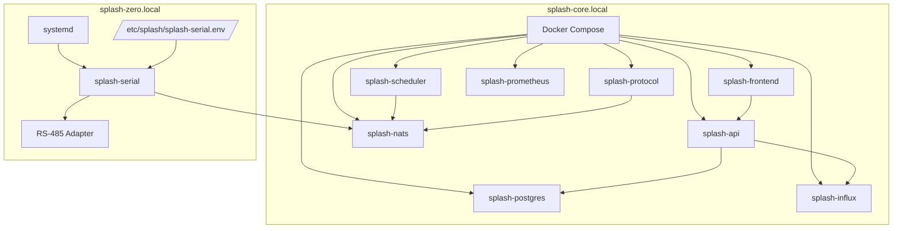
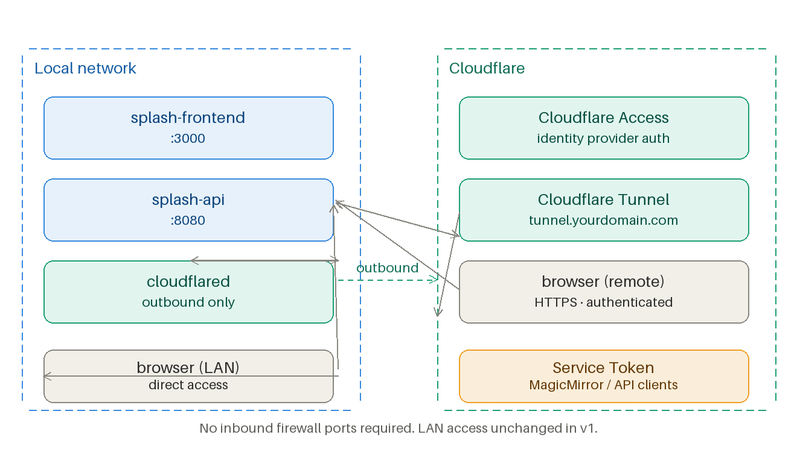
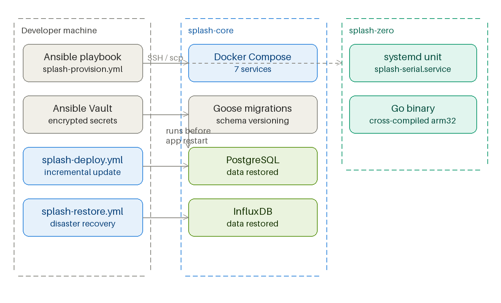

# Deployment Architecture

[Back to README](../README.md)

## Purpose

This document defines how Splash is deployed across hosts, runtimes, and supporting infrastructure.

## Deployment model



### `splash-core`

- Raspberry Pi 4/5, arm64
- Docker Compose deployment
- mDNS hostname: `splash-core.local`
- Exposes NATS across the LAN

### `splash-zero`

- Raspberry Pi Zero 2W, arm32/armv7
- Native Go binary managed by `systemd`
- mDNS hostname: `splash-zero.local`
- Connects to NATS at `nats://splash-core.local:4222`

## Compose and host layout

### Core host Compose responsibilities

- `splash-core/docker-compose.yml` runs all services except `splash-serial`
- NATS binds to `0.0.0.0:4222` for LAN clients
- API binds to `0.0.0.0:8080`
- Frontend binds to `0.0.0.0:3000`
- PostgreSQL, InfluxDB, and Prometheus remain internal-only

### Pi Zero runtime

- `splash-zero` uses a `systemd` unit instead of Docker
- Runtime configuration comes from `/etc/splash/splash-serial.env`
- The serial binary is cross-compiled and copied to the host
- `splash-serial` exposes a small local HTTP listener for health and Prometheus metrics

### Example environment variables

```dotenv
POSTGRES_DB=splash
POSTGRES_USER=splash
INFLUXDB_ORG=splash
INFLUXDB_BUCKET=pool_data
NATS_URL=nats://splash-nats:4222
WEATHER_PROVIDER=tomorrowio
WEATHER_API_KEY=your_key_here
POOL_ZIP_CODE=28052
SERIAL_DEVICE=/dev/ttyUSB0
PROTOCOL_PLUGIN=pentair_easytouch
SERIAL_RECONNECT_INTERVAL_MS=10000
SERIAL_WRITE_TIMEOUT_MS=2000
SERIAL_HTTP_BIND=127.0.0.1:9108
SERIAL_DEFAULT_IDLE_MS=50
LOG_LEVEL=info
TZ=America/New_York
```

### Serial-service configuration expectations

- `SERIAL_DEVICE` identifies the RS-485 adapter path
- `NATS_URL` points to the core message backbone
- `SERIAL_RECONNECT_INTERVAL_MS` controls reconnect cadence after adapter or port failure
- `SERIAL_WRITE_TIMEOUT_MS` bounds a single port-write attempt
- `SERIAL_HTTP_BIND` controls the local health and metrics listener
- `SERIAL_DEFAULT_IDLE_MS` defines the fallback bus-idle wait used when a write request does not specify a stricter requirement

## External integrations

### Weather provider

Splash abstracts weather through a `WeatherProvider` selected at startup.

- Default provider: Tomorrow.io
- Fallback provider: OpenWeatherMap
- Primary uses: UV, temperature, humidity, precipitation, forecasts, ZIP geocoding

### Sensor provider

Splash abstracts chemistry sensors through a `SensorProvider`.

- `manual`: default, no hardware polling
- `atlas`: planned/stubbed
- `modbus`: planned

### Remote access

v1 is LAN-only. v2 introduces Cloudflare Tunnel with Cloudflare Access in front of the frontend and API.



Caption: Remote access model for the future Cloudflare Tunnel deployment. The source describes this as a v2 architecture, not a v1 dependency.

### Provisioning and automation

Provisioning, deployment, backup, and disaster recovery are Ansible-driven.



Caption: Provisioning and deployment automation flow managed by Ansible across `splash-core` and `splash-zero`.

## Deployment notes

- `splash-serial` is cross-compiled with `GOOS=linux GOARCH=arm GOARM=7`
- the serial-service container is intentionally avoided on Pi Zero due to resource overhead
- `splash-protocol` is expected to run on `splash-core`, where protocol plugins and Protocol Explorer support can be managed without hardware coupling
- TypeScript services on `splash-core` may run in containers with the Node.js runtime; there is no requirement that every backend service compile to a single native binary
- `splash-serial` health and Prometheus endpoints should be bound locally unless an explicit remote-scrape design is added later
